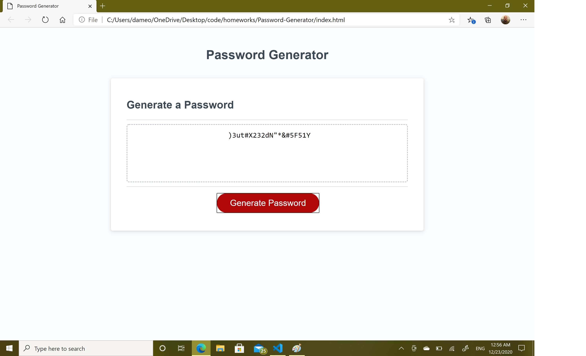

# Password-Generator
I want to make an application that generate a password using various types of characters.

* click on button to generate a password.
* ask what type of characters the user want to use.
* include upper case letters, low case letters, numbers and special characters as choices.
* generate the password with the given choices.

